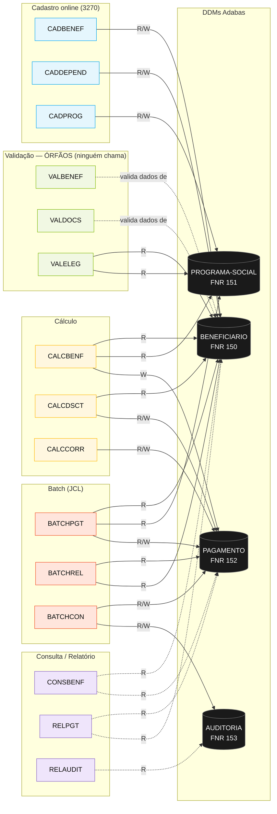
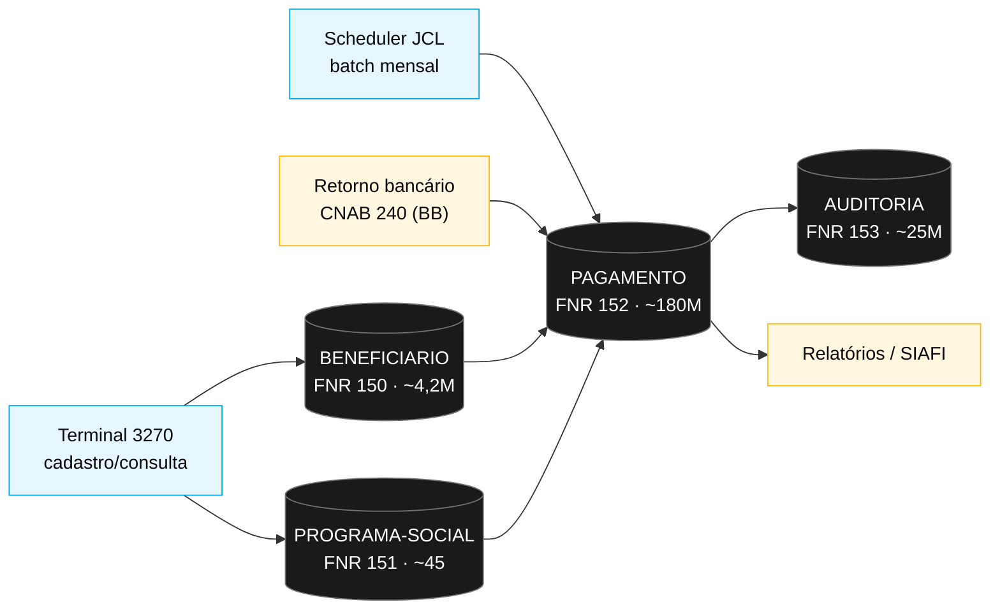

<!-- markdownlint-disable MD013 MD025 MD026 MD028 MD029 MD034 MD040 MD051 MD060 -->

# Mapa de Dependências — SIFAP Legado

  

> 🗺 **Você está aqui:** [Kit PT-BR](../README.md) → [Estágio 1](README.md) → **dependency-map**

> **Para quem é isto?** Este é um **artefato preenchido pelo time** durante o Estágio 1 (Arqueologia).
>
> **O que você terá ao final do estágio:**
>
> 1. Este documento totalmente preenchido com os dados reais do legado SIFAP
> 2. Rastreabilidade para `01-arqueologia/legado-sifap/` (programas `.NSN` e DDMs)
> 3. Base de evidência usada nas EARS do Estágio 2 (`source_legacy:`)
>
> 📘 **Guia passo a passo:** [`GUIDE.md`](GUIDE.md).

> Use diagramas Mermaid para mapear as dependências entre programas Natural e DDMs Adabas.
> O objetivo é visualizar "quem chama quem" e "quem lê/escreve o quê".

## Como descobrir dependências

- Use `grep` ou Copilot Chat para listar todas as ocorrências de `CALLNAT` nos 15 arquivos `.NSN`.
- Prompt útil: _"Liste todas as ocorrências de CALLNAT nestes arquivos e desenhe um diagrama Mermaid."_
- Para leitura/escrita em DDMs: procure por `READ`, `READ LOGICAL`, `STORE`, `UPDATE`, `DELETE`.

## Diagrama de Dependências entre Programas

> Mapeado por `@archaeologist-agent` em 2026-06-10 a partir da leitura dos 15 programas `.NSN`.
> **Achado estrutural nº 1 — não existe NENHUM `CALLNAT` em todo o sistema.** Os 15 programas são autocontidos; toda reutilização é por subrotinas internas (`PERFORM`). A integração entre programas acontece **exclusivamente pelos 4 DDMs Adabas compartilhados** (acoplamento por dados, não por chamada). Setas = acesso a DDM (R=leitura, W=escrita). Setas tracejadas = inferidas (programas de consulta/relatório cuja fonte não pôde ser lida por instabilidade de rede).

> **Achado estrutural nº 2 — dependências fantasma na documentação.** O Manual 2008 e o README descrevem chamadas que **não existem** no código:
> - O cabeçalho do próprio `BATCHPGT` diz "CHAMA CALCBENF E CALCDSCT" — **falso**: ele **duplica** as tabelas de fator regional/faixas de renda e o cálculo inline (subrotina `DET-FAIXA-RENDA-BATCH`).
> - A doc diz que `CADBENEF` chama os subprogramas `VALCPF` e `LOGAUDIT` — **falso**: `CADBENEF` tem subrotina interna `VALIDA-CPF` e **não grava auditoria**.
> - Os subprogramas `VALCPF`, `VALNISN`, `LOGAUDIT`, `CALCIDX`, `FMTVLR`, `FMTDT` citados no README §5.6 **não são invocados por programa algum** e não existem como arquivos `.NSN` no repositório (fantasmas).

## Diagrama de Fluxo de Dados (DDMs)

> Os 4 DDMs reais são **BENEFICIARIO (150)**, **PROGRAMA-SOCIAL (151)**, **PAGAMENTO (152)** e **AUDITORIA (153)**. O `PAGAMENTO` é o hub central: produzido por BATCHPGT/CALCBENF, mutado por CALCDSCT/CALCCORR/BATCHCON e consumido por BATCHREL/RELPGT.

## Tabela de Dependências

> **Coluna "Chama (CALLNAT)":** vazia para todos — não há `CALLNAT` no sistema (achado nº 1). A reutilização é por subrotinas `PERFORM` internas, indicadas entre parênteses.

| Programa | Chama (CALLNAT) | Lê (READ/FIND) DDMs | Escreve (STORE/UPDATE) DDMs | Observações |
| --- | --- | --- | --- | --- |
| CADBENEF.NSN | — (subrot. `VALIDA-CPF`) | BENEFICIARIO | BENEFICIARIO | Doc dizia chamar VALCPF/LOGAUDIT — não chama. **Sem auditoria.** |
| CADDEPEND.NSN | — | BENEFICIARIO | BENEFICIARIO (PE `DEPENDENTES`) | Limite de dependentes = **5** no código (doc dizia 3). |
| CADPROG.NSN | — (subrot. `CONSULTA-PROG`) | PROGRAMA-SOCIAL | PROGRAMA-SOCIAL | **Contém o `FATOR-K`** (`1.00 + FATOR-REAJ * 0.347215`). |
| CALCBENF.NSN | — (subrot. `DET-FAIXA-RENDA`, `CALC-DESCONTOS`) | BENEFICIARIO, PROGRAMA-SOCIAL | PAGAMENTO | Desconto interno simplificado (3%); **não** chama CALCDSCT. |
| CALCDSCT.NSN | — (subrot. `CALC-CONTRIB-SOCIAL`) | BENEFICIARIO (PE `DESCONTOS`), PAGAMENTO | PAGAMENTO | Teto 30% exceto judicial; alíquotas 3/5/7/9%. |
| CALCCORR.NSN | — (subrot. `CALC-INDICE-ACUM`) | PAGAMENTO | PAGAMENTO | Tabela IPCA interna 2010-2012; não chama CALCIDX (fantasma). |
| BATCHPGT.NSN | — (subrot. `DET-FAIXA-RENDA-BATCH`) | BENEFICIARIO, PROGRAMA-SOCIAL | PAGAMENTO | Recalcula inline; só processa status 'A'. |
| BATCHREL.NSN | — (subrot. `IMPRIME-CABECALHO`) | PAGAMENTO, BENEFICIARIO | — | Relatório consolidado; arredonda diferente (ROUND vs TRUNCATE). |
| BATCHCON.NSN | — (subrot. `GRAVA-AUDITORIA-*`) | PAGAMENTO, AUDITORIA, WORK FILE (CNAB 240) | PAGAMENTO, AUDITORIA | Concilia retorno do BB; bloco "Banco Real" comentado (morto). |
| VALBENEF.NSN | — (subrot. `VALIDA-CPF-COMPLETO`, `VALIDA-DATA`, `VALIDA-NOME`) | valida dados de BENEFICIARIO (via INPUT) | — | **Órfão**: ninguém o chama. Valida CPF/data/nome/UF. |
| VALDOCS.NSN | — (subrot. `VALIDA-CPF-DOC`, `VALIDA-RG`, `CHECK-DOC-ESPECIAL`) | valida dados de BENEFICIARIO (via INPUT) | — | **Órfão**. Prefixos especiais incl. '099'/'999'. |
| VALELEG.NSN | — (subrot. `VERIF-ELEG-ESPECIFICA`) | BENEFICIARIO, PROGRAMA-SOCIAL | — | **Órfão** no grafo de chamadas. Contém o bypass da região 99. |
| CONSBENF.NSN | — | BENEFICIARIO, PAGAMENTO *(inferido)* | — | Consulta online (SF05). Fonte não lida (rede) — inferido. |
| RELPGT.NSN | — | PAGAMENTO, BENEFICIARIO *(inferido)* | — | Relatório de pagamentos. Inferido. |
| RELAUDIT.NSN | — | AUDITORIA *(inferido)* | — | Relatório de auditoria. Inferido. |

## Dependências Circulares

> Liste aqui qualquer dependência circular encontrada (programa A chama B que chama A):

- **Nenhuma** — e não pode haver, pois não existe `CALLNAT` no sistema. No nível de **dados**, porém, há **acoplamento bidirecional** em torno do DDM `PAGAMENTO`: BATCHPGT/CALCBENF escrevem; CALCDSCT/CALCCORR/BATCHCON leem-e-reescrevem; BATCHREL/RELPGT leem. Qualquer mudança de schema em `PAGAMENTO` impacta **8 dos 15** programas.

## Programas Órfãos

> Programas que não são chamados por nenhum outro (possíveis pontos de entrada ou código morto):

- **Todos os 15 são "entry points"** no grafo de chamadas (zero CALLNAT). Distinção útil por papel:
  - **Pontos de entrada legítimos:** CADBENEF, CADDEPEND, CADPROG, CONSBENF (online/3270); BATCHPGT, BATCHREL, BATCHCON (JCL); CALCBENF, CALCDSCT, CALCCORR (online sob demanda); RELPGT, RELAUDIT (relatório).
  - **🔴 Órfãos suspeitos (validação que deveria ser reutilizada, mas não é):** `VALBENEF`, `VALDOCS`, `VALELEG`. A documentação (Manual 2008, RN-001) assume que o cadastro chama essas validações, mas **CADBENEF/CADDEPEND reimplementam a validação de CPF internamente** e nunca invocam VALELEG. Resultado: a validação de elegibilidade (incluindo o bypass da região 99) só roda se alguém executar VALELEG **manualmente** — não há gate automático no cadastro nem no batch.
  - **Código morto confirmado:** bloco "Banco Real" comentado em BATCHCON (após `END-WORK`); bloco "Plano Verão" comentado em CALCCORR.

---

### Continuar a leitura

<table width="100%">
<tr>
<td width="50%" valign="top" align="left">
<strong>← ANTERIOR</strong> 
<a href="business-rules-catalog.md"><strong>business-rules-catalog.md</strong></a> 
Catálogo de regras.
</td>
<td width="50%" valign="top" align="right">
<strong>PRÓXIMO →</strong> 
<a href="discovery-report.md"><strong>discovery-report.md</strong></a> 
Síntese final.
</td>
</tr>
</table>

↑ <a href="README.md">Voltar ao Kit PT-BR</a>

