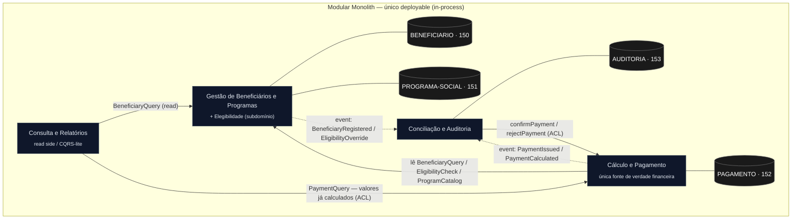

<!-- markdownlint-disable MD013 MD025 MD026 MD028 MD029 MD033 MD034 MD040 MD051 MD060 -->

# Mapa de Bounded Contexts — SIFAP Moderno

  

> **Autor:** `@architect-agent` (Software Architect protagonista) · **Data:** 2026-06-10
> **Entrada:** [discovery-report.md](../01-arqueologia/discovery-report.md) §3.5 · [dependency-map.md](../01-arqueologia/dependency-map.md) · [business-rules-catalog.md](../01-arqueologia/business-rules-catalog.md) · [glossary.md](../01-arqueologia/glossary.md)
> **Princípio:** Modular Monolith — bounded contexts = **módulos internos de um único deployable**. Comunicação **in-process** (interfaces / domain events), **nunca** HTTP entre serviços.
> **Regra de rastreabilidade:** toda decisão de fronteira abaixo cita uma descoberta concreta do Estágio 1.

---

## Critérios de Avaliação

Cada hipótese de recorte do Estágio 1 (§3.5 do discovery-report) é pontuada em três eixos. Quanto melhor o eixo, mais forte o candidato a contexto próprio.

| Critério | Pergunta | Fonte da evidência |
| --- | --- | --- |
| **Coesão** | As regras de negócio do grupo servem à **mesma capacidade**? | [business-rules-catalog.md](../01-arqueologia/business-rules-catalog.md) (regras por programa) |
| **Acoplamento** | Quantas arestas de acesso a dados **cruzam** a fronteira proposta? Poucas = bom. | [dependency-map.md](../01-arqueologia/dependency-map.md) (grafo de acesso a DDM) |
| **Frequência de mudança** | Os programas do grupo **mudam juntos** no legado (mesma família/fluxo)? | Famílias de prefixo (`CAD*`/`BATCH*`/`CALC*`/`VAL*`/`CONS*`/`REL*`) + [inventory.md](../01-arqueologia/inventory.md) |

> **Nota sobre acoplamento:** como o legado tem **zero `CALLNAT`** ([dependency-map.md](../01-arqueologia/dependency-map.md), achado nº 1), o acoplamento real é **100% por dados** em torno do DDM `PAGAMENTO` (FNR 152), que toca **8 dos 15** programas. As fronteiras abaixo são desenhadas para **conter** esse hub em um único contexto e blindá-lo com anti-corruption layers.

---

## Avaliação de Hipóteses

### Hipótese 1 — Cadastro de Beneficiários — **ACEITA** (renomeada para *Gestão de Beneficiários e Programas*)

> Programas: `CADBENEF`, `CADDEPEND`, `CADPROG` (+ `VAL*`). DDMs: `BENEFICIARIO` (150) + `PROGRAMA-SOCIAL` (151).

| Critério | Score | Evidência |
| --- | --- | --- |
| Coesão | **Alta** | Todas as regras servem a "manter dados cadastrais corretos": módulo-11 do CPF (CADBENEF #2/#3/#13), limite de 5 dependentes (CADDEPEND), `FATOR-K` do programa (CADPROG). [business-rules-catalog.md](../01-arqueologia/business-rules-catalog.md). |
| Acoplamento | **Baixo (de saída)** | `BENEFICIARIO`/`PROGRAMA-SOCIAL` só são **escritos** por `CAD*`; os demais programas apenas **leem**. Fronteira de escrita limpa. [dependency-map.md](../01-arqueologia/dependency-map.md). |
| Frequência de mudança | **Alta coesão temporal** | Família `CAD*` muda junto (entrada de dados online 3270). |

**Recomendação:** ACEITAR como contexto, **absorvendo a Hipótese 3 (Elegibilidade)** como subdomínio (ver H3). `PROGRAMA-SOCIAL` (151) fica aqui por ora — é parametrização de baixo volume (~45 registros) lida por Cálculo; sua separação futura em um contexto "Catálogo de Programas" é **candidata a ADR**, mas não se justifica agora (coesão com a decisão de elegibilidade).

---

### Hipótese 2 — Motor de Cálculo e Pagamento — **ACEITA**

> Programas: `BATCHPGT`, `CALCBENF`, `CALCDSCT`, `CALCCORR`. DDM: `PAGAMENTO` (152).

| Critério | Score | Evidência |
| --- | --- | --- |
| Coesão | **Alta** | Todos produzem/mutam o valor pago: bruto (CALCBENF/BATCHPGT), descontos com teto de 30% (CALCDSCT), correção monetária (CALCCORR). |
| Acoplamento | **Alto HOJE, contido pela fronteira** | `PAGAMENTO` é hub bidirecional tocado por 8/15 programas ([dependency-map.md](../01-arqueologia/dependency-map.md)). Colocar **toda escrita de `PAGAMENTO`** dentro deste contexto **reduz** o acoplamento global a um único dono. |
| Frequência de mudança | **Altíssima — devem mudar juntos** | `BATCHPGT` e `CALCBENF` **duplicam** a lógica financeira (MYS-011): um reajuste hoje exige editar dois lugares. Forte argumento para unificar. |

**Recomendação:** ACEITAR. **Unificar a lógica financeira duplicada** numa única fonte de verdade dentro deste contexto (resolve MYS-011/012/014). Este contexto é o **único** com permissão de escrita em `PAGAMENTO`.

---

### Hipótese 3 — Elegibilidade — **REJEITADA como contexto próprio · ABSORVIDA por H1**

> Programa: `VALELEG`. Lê `BENEFICIARIO` + `PROGRAMA-SOCIAL`.

| Critério | Score | Evidência |
| --- | --- | --- |
| Coesão | **Média** | É uma **decisão** (quem pode receber), não um aggregate com dados próprios. |
| Acoplamento | **Muito alto** | `VALELEG` **não possui dado algum**: lê 100% de `BENEFICIARIO`+`PROGRAMA-SOCIAL`, ambos de H1. Uma fronteira aqui criaria leitura cross-context chatty sobre dados de outro dono. |
| Frequência de mudança | **Acoplada a H1** | Regras de elegibilidade dependem dos campos do beneficiário e dos parâmetros do programa — mudam com eles. |

**Recomendação:** REJEITAR contexto próprio. **Absorver como subdomínio publicado de H1** (`EligibilityCheck`), pelos motivos: (a) opera 100% sobre dados de H1 — DDD diz que a decisão mora onde o dado mora; (b) `VALELEG` é **órfão** hoje (MYS-032) — não há gate automático; promovê-lo a **interface publicada** de H1 cria o gate que falta, chamado **no cadastro e no pagamento**; (c) concentra a governança do **bypass da região 99** (MYS-008, risco de fraude) num único ponto auditável. **Candidato a ADR** (decisão de fronteira + gate + governança da região 99).

---

### Hipótese 4 — Conciliação e Auditoria — **ACEITA**

> Programas: `BATCHCON`, `RELAUDIT`. DDM: `AUDITORIA` (153).

| Critério | Score | Evidência |
| --- | --- | --- |
| Coesão | **Alta** | Reconciliação do retorno bancário (CNAB 240/BB) + trilha de auditoria são a capacidade "fechar o ciclo e provar o que aconteceu". [dependency-map.md](../01-arqueologia/dependency-map.md). |
| Acoplamento | **Médio — exige anti-corruption** | `BATCHCON` hoje **lê-e-reescreve `PAGAMENTO`** (status de retorno). Isso **cruza** a fronteira de H2. Resolve-se trocando a escrita direta por um **comando publicado** de H2 (`confirmPayment`/`rejectPayment`). |
| Frequência de mudança | **Própria** | Muda por motivos de integração bancária (layout CNAB) e compliance, não por regra de cálculo. |

**Recomendação:** ACEITAR. Dono exclusivo de `AUDITORIA` (153). **Não escreve `PAGAMENTO` diretamente** — usa comando publicado de H2 (anti-corruption layer). Recebe **domain events** de todos os contextos para a trilha (torna a auditoria obrigatória — resolve MYS-018, hoje CADBENEF não audita).

---

### Hipótese 5 — Consulta e Relatórios — **ACEITA** (como *read side* / CQRS-lite, sem dados próprios)

> Programas: `CONSBENF`, `RELPGT`, `BATCHREL`. Lê `PAGAMENTO`/`BENEFICIARIO` (somente leitura).

| Critério | Score | Evidência |
| --- | --- | --- |
| Coesão | **Alta** | Capacidade única: **expor** dados (consulta online + relatórios + extração SIAFI). Somente leitura. |
| Acoplamento | **Baixo se for leitura pura** | Não possui dado próprio; lê de H1/H2. Vira **alto e perigoso** se reimplementar cálculo — é exatamente o que `BATCHREL` faz hoje (arredonda `ROUND` vs `TRUNCATE` do batch, divergindo do valor pago). [dependency-map.md](../01-arqueologia/dependency-map.md). |
| Frequência de mudança | **Própria** | Muda por demanda de relatório/visualização, não por regra de negócio. |

**Recomendação:** ACEITAR como **contexto de leitura fino** (read models / CQRS-lite). **Anti-corruption obrigatório:** consome valores **já calculados** publicados por H2 e **nunca** reimplementa a matemática monetária (resolve a divergência de arredondamento de `BATCHREL`). **Candidato a ADR** (read side sem reimplementar cálculo).

---

## Bounded Contexts Finais

São **4 contextos**, dentro de um único deployable (Modular Monolith), package-by-feature.

### 1. Gestão de Beneficiários e Programas *(Beneficiary & Program Management)*

- **Responsabilidade:** Possui o ciclo de vida cadastral do beneficiário, seus dependentes e a parametrização dos programas sociais. É a **fonte da verdade de "quem existe, com quais dados e sob qual programa"** e o **dono da decisão de elegibilidade** (subdomínio que absorve `VALELEG`), incluindo a governança do bypass da região 99. Valida CPF (módulo 11), limite de dependentes e integridade dos parâmetros de programa (incl. `FATOR-K`).
- **Dados próprios (DDMs/tabelas):** `BENEFICIARIO` (FNR 150) · `PROGRAMA-SOCIAL` (FNR 151).
- **Interface pública:**
  - `BeneficiaryQuery.findById(beneficiaryId) : BeneficiaryView` (read DTO)
  - `BeneficiaryQuery.findActivePayable(programId) : Stream<BeneficiaryId>` (substitui o filtro `status 'A'` do batch)
  - `EligibilityCheck.evaluate(beneficiaryId, programId) : EligibilityResult` (gate automático — resolve MYS-032)
  - `ProgramCatalog.getParameters(programId) : ProgramParametersView` (faixas de renda/idade, `FATOR-K`)
  - eventos: `BeneficiaryRegistered`, `BeneficiaryStatusChanged`, `EligibilityOverrideApplied` (governança região 99)
- **Por que é um contexto próprio:** alta coesão cadastral + fronteira de **escrita** limpa sobre 150/151 (só `CAD*` escreve); elegibilidade mora aqui porque opera 100% sobre estes dados.

### 2. Cálculo e Pagamento *(Benefit Calculation & Payment)*

- **Responsabilidade:** Possui **toda a lógica financeira e o ciclo de vida do pagamento**: cálculo do benefício bruto (fatores regional/familiar/renda/idade), descontos com teto de 30% e exceção judicial, correção monetária e geração do pagamento mensal. É a **única fonte de verdade financeira** (unifica a duplicação BATCHPGT/CALCBENF — MYS-011) e o **único contexto com escrita em `PAGAMENTO`**.
- **Dados próprios (DDMs/tabelas):** `PAGAMENTO` (FNR 152).
- **Interface pública:**
  - `PaymentCommand.runMonthlyCycle(referenceMonth) : CycleResult`
  - `PaymentCommand.confirmPayment(paymentId, bankReturn)` / `rejectPayment(paymentId, reason)` (consumidos por Conciliação — substitui escrita direta cross-context)
  - `PaymentQuery.findByBeneficiary(beneficiaryId, period) : PaymentView` (valores já calculados — anti-corruption para relatórios)
  - eventos: `PaymentCalculated`, `PaymentIssued`, `PaymentConfirmed`, `PaymentRejected`
- **Por que é um contexto próprio:** os programas de cálculo **mudam juntos** (maior frequência de co-mudança) e conter o hub `PAGAMENTO` num único dono é o que reduz o acoplamento global de 8/15 programas para um ponto controlado.

### 3. Conciliação e Auditoria *(Reconciliation & Audit)*

- **Responsabilidade:** Possui a **reconciliação do retorno bancário** (CNAB 240 / Banco do Brasil) contra os pagamentos emitidos e a **trilha de auditoria** de todo o sistema. Atualiza o status do pagamento **via comando publicado** de Cálculo e Pagamento (não escreve `PAGAMENTO` diretamente). Materializa eventos de domínio dos demais contextos numa trilha imutável, tornando a auditoria **obrigatória** (resolve MYS-018).
- **Dados próprios (DDMs/tabelas):** `AUDITORIA` (FNR 153).
- **Interface pública:**
  - `ReconciliationCommand.processBankReturn(cnabFile) : ReconciliationReport`
  - `AuditQuery.findTrail(entityRef, period) : Stream<AuditEntry>`
  - consome eventos: `BeneficiaryRegistered`, `PaymentCalculated`, `PaymentIssued`, `PaymentConfirmed`, `EligibilityOverrideApplied`
- **Por que é um contexto próprio:** capacidade distinta (integração bancária + compliance) que muda por motivos próprios; dono natural de `AUDITORIA` (153), o único DDM que ninguém mais escreve.

### 4. Consulta e Relatórios *(Query & Reporting — read side)*

- **Responsabilidade:** Expõe os **caminhos somente-leitura**: consulta online de beneficiários/pagamentos e geração de relatórios consolidados e extrações SIAFI. **Não possui dados próprios** nem regras de negócio — projeta read models a partir de H1 e H2 e **reutiliza os valores já calculados** por Cálculo e Pagamento, sem nunca reimplementar a matemática monetária (corrige a divergência de arredondamento de `BATCHREL`).
- **Dados próprios (DDMs/tabelas):** nenhum (read models derivados; CQRS-lite).
- **Interface pública:**
  - `ReportingQuery.consolidatedPayments(filters) : PaymentReport`
  - `ReportingQuery.beneficiaryStatement(beneficiaryId) : Statement`
  - `ReportingQuery.siafiExport(period) : SiafiFile`
- **Por que é um contexto próprio:** capacidade de leitura que muda por demanda de relatório, isolada para impedir que regras de apresentação contaminem (ou divirjam de) as regras de negócio dos donos dos dados.

---

## Comunicação Inter-Context

> Modular Monolith: **toda comunicação é in-process** — chamadas de método via interface publicada ou domain events in-process. **Nada de HTTP entre contextos.**

| De → Para | Direção | Mecanismo | Dados trocados |
| --- | --- | --- | --- |
| Cálculo e Pagamento → Gestão de Beneficiários | Cálculo chama Gestão | Interface in-process (`BeneficiaryQuery`, `ProgramCatalog`, `EligibilityCheck`) | IDs + read DTOs (somente leitura; sem escrever dados cadastrais) |
| Conciliação e Auditoria → Cálculo e Pagamento | Conciliação chama Cálculo | Interface in-process (`PaymentCommand.confirm/reject`) | `paymentId` + dados do retorno bancário (**substitui** a escrita direta em `PAGAMENTO` — anti-corruption) |
| Cálculo e Pagamento → Conciliação e Auditoria | Cálculo emite | Domain event in-process (`PaymentIssued`, `PaymentCalculated`) | Evento (paymentId, valores, timestamp) |
| Gestão de Beneficiários → Conciliação e Auditoria | Gestão emite | Domain event in-process (`BeneficiaryRegistered`, `EligibilityOverrideApplied`) | Evento (entityRef, ator, motivo) — fecha MYS-018/MYS-008 |
| Consulta e Relatórios → Gestão de Beneficiários | Consulta chama Gestão | Interface in-process (`BeneficiaryQuery`) | Read DTOs |
| Consulta e Relatórios → Cálculo e Pagamento | Consulta chama Cálculo | Interface in-process (`PaymentQuery`) | Valores **já calculados** (anti-corruption — não reimplementa cálculo) |

**Anti-corruption layers (fronteiras críticas):**

1. **Hub `PAGAMENTO`:** apenas **Cálculo e Pagamento** escreve. Conciliação e Relatórios acessam por interface publicada, não por schema (resolve o acoplamento bidirecional de 8/15 programas).
2. **Elegibilidade:** exposta por **Gestão de Beneficiários**; Cálculo consulta o gate, não reimplementa a regra (resolve a órfandade MYS-032).
3. **Relatórios:** consomem valores calculados, nunca recalculam (resolve a divergência de arredondamento de `BATCHREL`).

---

## Diagrama Mermaid do Mapa de Contexto

> Paleta do kit: contexto `fill #0f172a / stroke #334155 / text #e2e8f0`. Setas cheias = chamada de método via interface; setas tracejadas = domain event in-process. DDMs em preto = propriedade exclusiva de um único contexto.

---

## Decisões que devem virar ADR (Estágio 2)

> Levar para `/generate-adr`. Cada uma é uma escolha estrutural com trade-offs e rastreabilidade ao Estágio 1.

1. **ADR — `PAGAMENTO` (152) como aggregate de dono único.** Apenas Cálculo e Pagamento escreve; Conciliação atualiza status por comando publicado. *Trade-off:* latência/indireção vs. eliminar o acoplamento bidirecional de 8/15 programas. *Fonte:* [dependency-map.md](../01-arqueologia/dependency-map.md) (hub bidirecional), MYS-006.
2. **ADR — Elegibilidade como subdomínio publicado de Gestão de Beneficiários** (não contexto próprio) + gate automático no cadastro e no pagamento + governança da região 99. *Fonte:* MYS-032 (órfão), MYS-008 (fraude).
3. **ADR — Unificação da lógica financeira** numa única fonte de verdade em Cálculo e Pagamento. *Fonte:* MYS-011 (duplicação BATCHPGT/CALCBENF), MYS-012/014 (fórmula/descontos divergentes).
4. **ADR — Auditoria orientada a domain events** (trilha obrigatória cross-context). *Fonte:* MYS-018 (CADBENEF não audita hoje).
5. **ADR — Consulta e Relatórios como read side (CQRS-lite)** sem reimplementar cálculo. *Fonte:* divergência de arredondamento `BATCHREL` (`ROUND` vs `TRUNCATE`).
6. **ADR (futuro/condicional) — Separar `PROGRAMA-SOCIAL` (151) em "Catálogo de Programas".** Rejeitado agora (coesão com elegibilidade); reabrir se a parametrização de programas ganhar regras próprias.

---

## Definição de Pronto — checklist

- [x] Toda hipótese (§3.5) avaliada contra os três critérios com scorecard.
- [x] Hipótese rejeitada (Elegibilidade) com raciocínio documentado.
- [x] 4 bounded contexts finalizados com nomes em linguagem de negócio.
- [x] Cada contexto com responsabilidade, dados próprios e interface pública.
- [x] Diagrama Mermaid de context map com relacionamentos.
- [x] Nenhum contexto isolado — todos os caminhos de comunicação definidos.
- [x] Cada decisão de fronteira rastreia para uma descoberta do Estágio 1.
